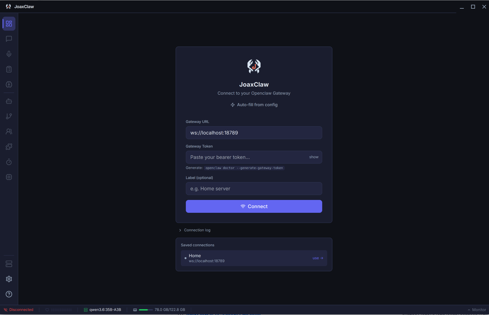
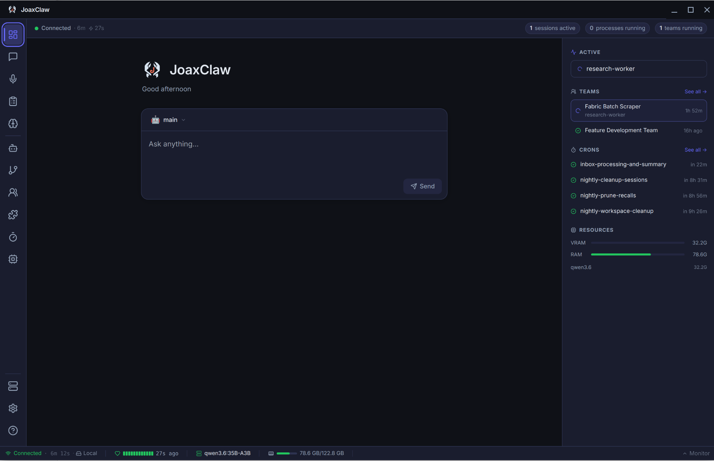
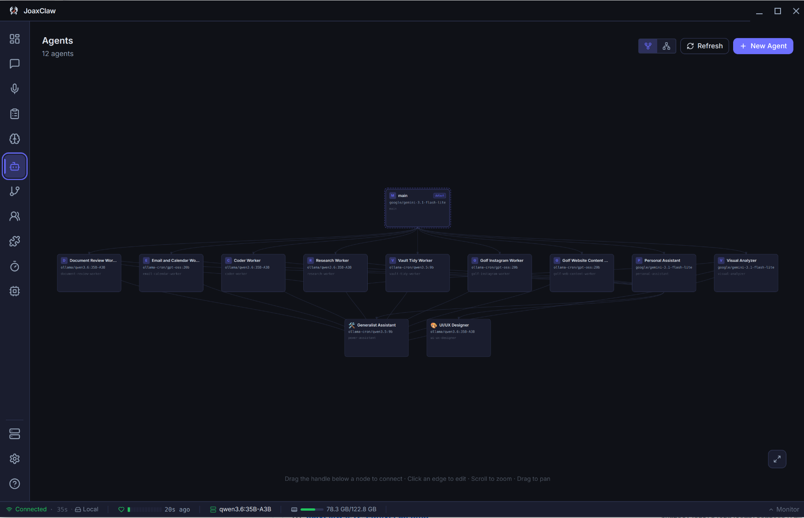
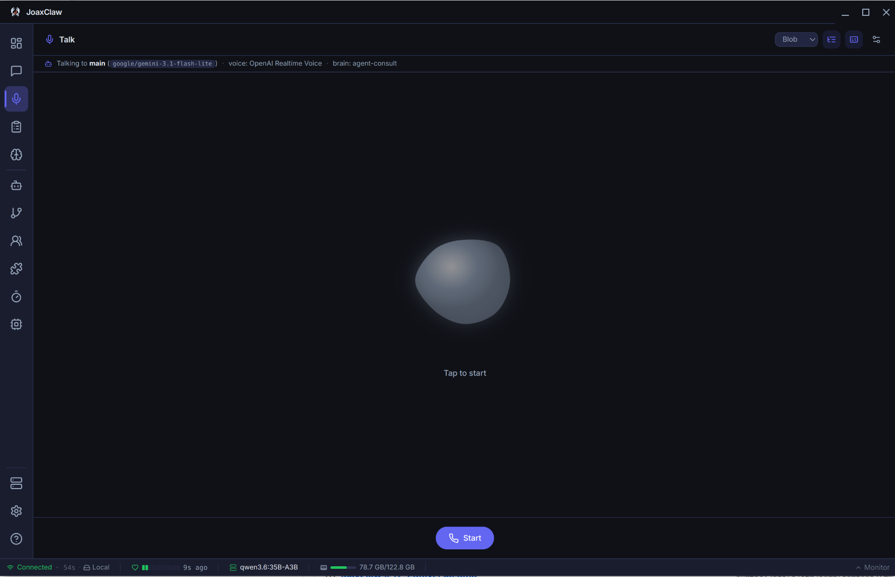

# JoaxClaw

A desktop control UI for [OpenClaw](https://openclaw.dev) — a self-hosted AI agent
gateway. Chat with your agents, build multi-agent teams, manage channels and models,
schedule jobs, and configure plugins — for a local **or** remote gateway. Built with
Electron, React, and TypeScript.


## Screenshots

|  |  |
| :---: | :---: |
| <br>**Connect** — local or remote gateway | <br>**Dashboard** — quick-send, recent chats, live metrics |
| <br>**Agents** — visual agent hierarchy | <br>**Talk** — voice conversations |

## Features

- **Chat** — streaming responses with reasoning blocks and tool-call visibility; inline
  image / video / audio; image attachments and voice input.
- **Agents & Sessions** — manage configured agents; browse, search, and replay sessions.
- **Teams & Processes** — a visual builder for multi-agent workflows with conditional
  branching and skip-style routing, revision history, and a live execution monitor.
  `TeamBlueprint` (`.team.json`) is the durable source of truth, not the compiled graph.
- **Channels** — manage the messaging platforms your gateway talks on (~33 supported):
  per-channel credentials, scoped agent routing (account / group / Slack team / Discord
  guild), multi-account, in-app WhatsApp QR pairing, and a **policy editor**
  (DM/allowlist/group policy + per-platform action permissions).
- **CRON jobs** — schedule an agent turn or an **entire team run**; the gateway runs it
  on schedule, unattended.
- **Models** — configure providers (Ollama, OpenAI, Google, and many more), track
  per-model usage and cost; the model picker also surfaces each engine's installed
  models.
- **Local LLM engines** — detect and health-check Ollama, LM Studio, vLLM, llama.cpp,
  Jan, and KoboldCpp, with CRON-isolation guidance.
- **Plugins** — enable/disable and **configure** plugins, including routing API keys to
  the right place in the gateway config, with a configured/needs-key badge.
- **Remote gateways** — Teams, Processes, and local-engine health work over a remote
  gateway via the bundled [`joaxclaw-fs`](plugins/joaxclaw-fs/) plugin (on npm as
  [`openclaw-joaxclaw-fs`](https://www.npmjs.com/package/openclaw-joaxclaw-fs)),
  installable from the app in one click.
- **Obsidian** — vault browser, graph view, and memory panel.
- **Mobile (PWA)** — the same app, installable on a phone: pairs as its own device, with
  a phone design pass on every view and background notifications. See
  [On your phone](#on-your-phone-pwa).
- **Dashboard & themes** — quick-send, recent conversations, live metrics; dark / light /
  custom themes with full CSS-variable control.

See [ROADMAP.md](ROADMAP.md) for where things are headed and [CHANGELOG.md](CHANGELOG.md)
for release history.

## Requirements

- An [OpenClaw gateway](https://openclaw.dev/docs/gateway) running locally or remotely.
- Linux x86-64 or macOS (universal). Ollama (or another local engine) is optional.

## Install

Grab the latest build from the [Releases](../../releases) page.

**Linux** (`.deb`):

```bash
sudo dpkg -i joaxclaw_*.deb
sudo apt-get install -f   # pull in any missing dependencies
```

Launch **JoaxClaw** from your app menu or run `joaxclaw`.

**macOS** (`.dmg`) — the build is currently **unsigned**, so macOS blocks it on first
launch. Open **System Settings → Privacy & Security → Open Anyway**, or run:

```bash
sudo xattr -rd com.apple.quarantine /Applications/JoaxClaw.app
```

## Connect to your gateway

On first launch, enter your gateway URL and token:

- **URL**: `ws://localhost:18789` for a local gateway (or your remote `ws://…`).
- **Token**: generate with `openclaw doctor --generate-gateway-token`.

On a local install, **Auto-fill from config** reads credentials straight from
`~/.openclaw/openclaw.json`. Saved connections are backed up to a local file so a
browser-storage reset can't lose them.

For a **remote** gateway, install the `joaxclaw-fs` plugin on the host so Teams,
Processes, and engine health work over the connection — the app offers a one-click
**Install via agent** flow, or run it manually:

```bash
openclaw plugins install --force openclaw-joaxclaw-fs && openclaw plugins enable joaxclaw-fs && openclaw gateway restart
```

## On your phone (PWA)

The renderer also builds as a plain web app you can install on a phone — same features,
same gateway connection, no app store.

```bash
npm run build:web    # static bundle → out/web
```

Serve `out/web` from anywhere your phone can reach, then open it and **Add to Home
Screen**. Two things to get right:

- **A secure context.** Service workers, install, and the WebCrypto device key all
  require **HTTPS** (or `localhost`) — a plain `http://192.168.…` origin won't do.
  Tailscale Serve or any TLS-terminating reverse proxy in front of the bundle works.
- **An allowed origin.** Loopback, RFC1918, `.local`, and `.ts.net` origins are
  auto-accepted by the gateway; anything else has to be listed in
  `gateway.controlUi.allowedOrigins`, or the connection is refused before scopes are
  even considered.

The phone pairs as **its own device** — it generates a non-extractable Ed25519 key and
signs the connect challenge, so it never needs the desktop's token. On first connect the
app shows the device id and waits; approve it on the host and it connects on its own:

```bash
openclaw devices approve --latest
```

Turn on **Settings → Notifications** to get an OS notification when a reply, reminder, or
team/process run finishes while the app is backgrounded. Design notes and the scope
research behind all of this: [docs/mobile-companion.md](docs/mobile-companion.md).

## Develop

```bash
npm install
npm run dev          # hot-reload dev build (Electron)
npm run dev:web      # the same renderer in a browser, for the PWA / mobile layout
npm run build        # production build
npm run build:web    # static web bundle → out/web (npm run preview:web to serve it)
npm run build:site   # joaxclaw.ai landing page → out/site
npm run package:linux  # build the .deb (npm run package:mac for the .dmg)
```

`npm test`, `npm run lint`, and `npm run type-check` run in the pre-commit hook (along
with a secret scanner). **Stack:** Electron 33 · React 18 · TypeScript · Vite ·
Tailwind CSS · Zustand.

Architecture notes live next to the code, e.g. [`src/lib/TEAMS.md`](src/lib/TEAMS.md)
(team blueprint/compiled boundary) and
[`src/lib/LOCAL_ENGINES.md`](src/lib/LOCAL_ENGINES.md).

## Releasing

Bump `version` in `package.json`, update `CHANGELOG.md`, and push to `main`. GitHub
Actions creates the release and builds the Linux `.deb` + macOS `.dmg`. The
`joaxclaw-fs` plugin publishes to npm separately when its own version changes.

The [joaxclaw.ai](https://joaxclaw.ai) site is deployed by **Vercel** from this repo —
`vercel.json` runs `npm run build:site` and serves `out/site`. `main` is the production
branch; every other branch gets a preview deployment, so a site change can be reviewed on
a real URL before it's merged. Publishing a release also pings a deploy hook (if the
`VERCEL_DEPLOY_HOOK` secret is set) so the download links pick up the new artifacts.

## Contributing

Issues and pull requests are welcome. Before opening a PR, please run
`npm run lint && npm run type-check && npm test`. For larger changes, open an issue first
to discuss the approach — the [roadmap](ROADMAP.md) is intentionally lightweight and
shaped by real use.

## License

[MIT](LICENSE) © Joaquin Ayuso.
